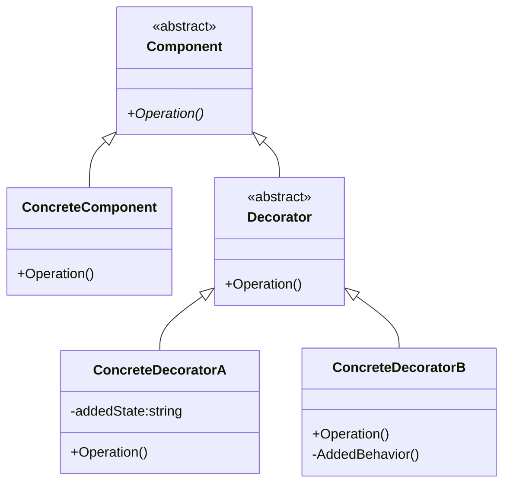

## 装饰者式
> `装饰模式`(Decorator),动态地给一个对象添加一些额外的职责，就增加功能来说，装饰模式比生成子类更加灵活。

### 类图


### 代码
```C#
abstract class Component
{
    public abstract void Operation();
}
class ConcreteComponent : Component
{
    public override void Operation()
    {
        // 具体对象操作。
    }
}

abstract class Decorator : Component
{
    protected Component component;
    public void SetComponent(Component component)
    {
        this.component = component;
    }
}

public override void Operation()
{
    if(null != component)
    {
        component.Operation();
    }
}
class ConcreteDecoratorA : Decorator{
    private string addedState;

    public override void Operation()
    {
        base.Operation();
        addStatus = "";
        // TOOD:
    }
}

class ConcreteDecoratorB : Decorator{
    public override void Operation()
    {
        base.Operation();
        AddBehavior();
        // TODO;
    }

    private vpod AddedBehavior()
    {

    }
}

static void Main(string[] args)
{
    ConcreteComponent c = new ConreteComponent();
    ConcreteDecoratorA d1 = new ConcreteDecoratorA();
    ConcreteDecorator2 d2 = new ConcreteDecoratorA()

    d1.SetComponent(c);
    d2.Operation(c);
    // 结果
}
```
&emsp;&emsp;装饰模式是利用`SetComponent`来对对象进行封装，这样每个装饰对象的实现就和如何使用这个对象分开，每个装饰对象只关心自己的功能，不需要关系如何被添加到对象链中。如果只有一个`ConcreteComponent`类而没有抽象的`Component`类，那么`Decorator`类可以是`ConcreteComponent`的一个子类。同样道理，如果只有一个`ConcreteDecorator`类，那么就没有必要建立一个单独的`Decorator`类，而可以把`Decorator`和`ConcreteDecorator`的责任合并成一个类。
```Mermaid
classDiagram
    class Person{
        +Show()
    }
    class Finery{
        +Show()
    }
    class BigTShirt{
        +Show()
    }
    class KuaKu{
        +Show()
    }
    class PoQiuXie{
        +Show()
    }
    class XiKu{
        +Show()
    }
    class Tie{
        +Show()
    }
    class Shoe{
        +Show()
    }
    Person<|-- Finery
    Finery<|-- BigTShirt
    Finery<|-- KuaKu
    Finery<|-- PoQiuXie
    Finery<|-- XiKu
    Finery<|-- Tie
    Finery<|-- Shoe
```

### 代码
```C#
class Person
{
    private string name;
    public Person(){}
    public Person(string name){
        this.name = name;
    }
    public virual void Show(){
        Console.WriteLine($"Dress up {this.name}")
    }
}
class Finery : Person
{
    protected Person component;
    public Finery(Person component)
    {
        this.component = component;
    }
    public override void Show()
    {
        if(null != this.component)
        {
            this.component.Show();
        }
    }
}

class BigTShirt : Finery
{
    public override void Show()
    {
        Console.WriteLine("BigTShirt.")
        base.Show();
    }
}

class KuaKu : Finery
{
    public override void Show()
    {
        Console.WriteLine("KuaKu");
        base.Show();
    }
}
// others class.
```
### 总结
&emsp;&emsp;当系统需要新功能的时候，是向旧类中添加新的代码。这些新代码通常装饰了原有的核心责任或行为，在主类加入新的字段，新的方法和新的逻辑，从而增加了主类的复杂度，而这些新加入的东西仅仅是为了满足一些只在某种特定的情况下才会执行的特殊行为的需要。`装饰模式`却提供了一个非常好的解决方案，它把每个要装饰的功能放在单独的类中，并让这个类包它所要的对象，因此，当需要执行特殊行为时，客服端可以在运行时根据需要有选择地，按顺序地使用装饰功能包装对象。