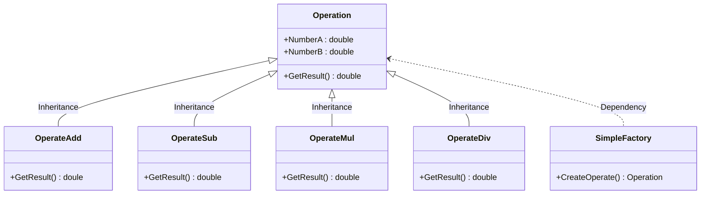
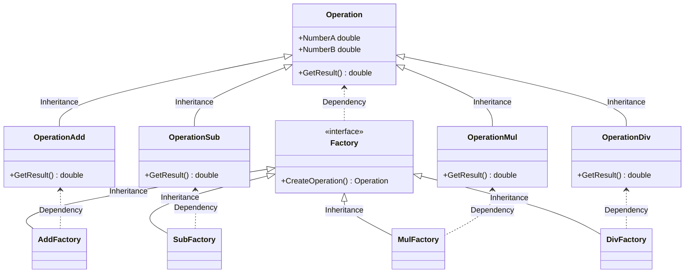

## 工厂方法模式

### 简单工厂
> `简单工厂`模式的最大邮件在于工厂类中包含了必要的逻辑判断，根据客户端的选择条件动态实例化相关的类，对于客户端来说，去除了与具体产品的依赖。
#### 类图


#### 代码
```C#
class OperateFactory
{
    public static Operation CreateFactory(string operate)
    {
        Operation oper = null;
        switch(operate)
        {
            case "+":
                oper = new OperateAdd();
                break;
            case "-":
                oper = new OperateSub();
                break;
            case "*":
                oper = new OperateMul();
                break;
            case "/":
                oper = new OperateDiv();
                break;
        }
        return oper;
    }
}
static void Main(string[] args)
{
    Operation oper = OperationFactory.CreateOperate("+");
    oper.NumberA = 1;
    Oper.NumberB = 2;
    double result = oper.GetResult();
}
```

### 工厂方法模式
> `工厂方法模式`(Factory Method)，定义一个用于创建对象的接口，让子类决定实例化哪一个类。工厂方法是一个类的实例化延迟到其子类。
#### 类图


#### 代码
```C#
interface IFactory
{
    Operation CreateOperation();
}
class AddFactory : IFactory
{
    public Operation CreateOperation()
    {
        return new OperationAdd();
    }
}
class SubFactory : IFactory
{
    public Operation CreateOperation()
    {
        return new OperationSub();
    }
}
class MulFactory : IFactory
{
    public Operation CreateOperation()
    {
        return new OperationMul();
    }
}
class DivFactory : IFactory
{
    public Operation CreateOperation()
    {
        return new OperationDiv();
    }
}

static void Main(string[] args)
{
    IFactory operFactory = new AddFactory();
    Operation oper = operFactory.CreateOperation();
    oper.NumberA = 1;
    oper.NumberB = 2;
    double result = oper.GetResult();
}
```
