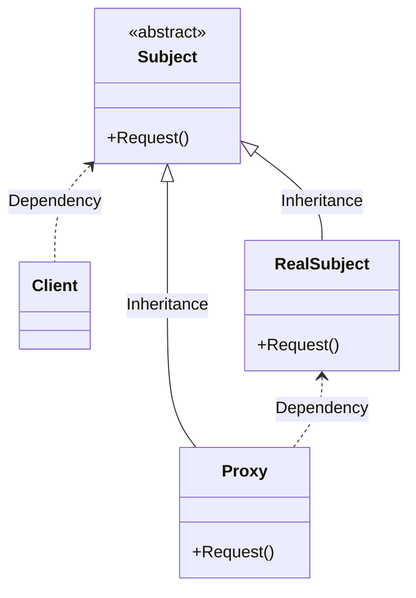

## Proxy
> `代理模式`，为其他对象提供一种代理以控制对这个对象的访问。

### 类图

### 代码
```C#
abstract class Subject
{
    public abstract void Request();
}
class RealSubject : Subject
{
    public override void Request()
    {
        Console.WriteLine("Real Request.");
    }
}
class Proxy : Subject
{
    RealSubject realSubject;
    public override void Request()
    {
        if(null == realSubject)
        {
            realSubject = new RealSubject();
        }
        realRequest.Request();
    }
}

static void Main(string[] args)
{
    Proxy proxy = new Proxy();
    proxy.Request();
}
```

### 总结
> `代理模式`一般有四种场景。
>1. 远程代理，也就是为一个对象在不同的地址空间提供局部代表。这样可以隐藏一个对象存在于不同地址空间的事实。
> 2. 虚拟代理，是根据需要创建开销较大的对象。通过它来存放实例化需要很长时间的真是对象。
> 3. 安全代理，用来控制真是对象访问时的权限。一般用于对象应该有不同的访问权限的时候。
> 4. 智能指引，是指当调用真实的对象时，代理处理另外一些事。