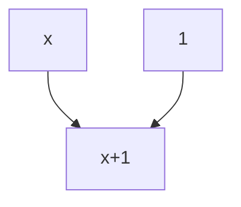
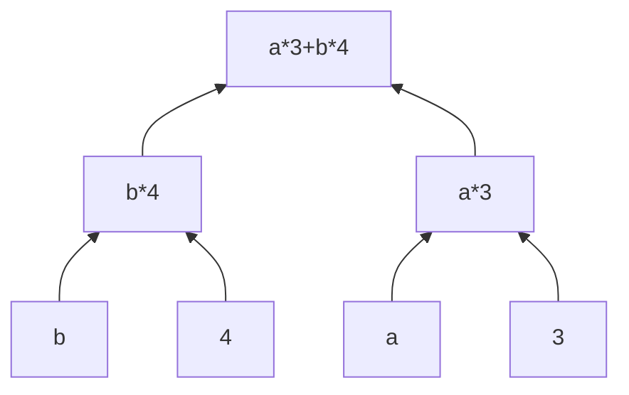
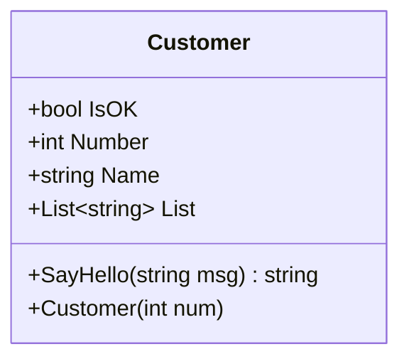
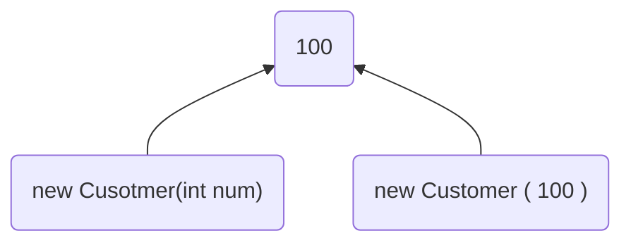
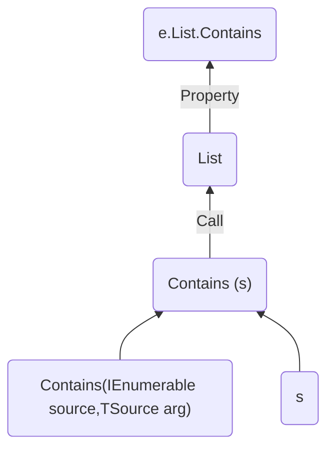
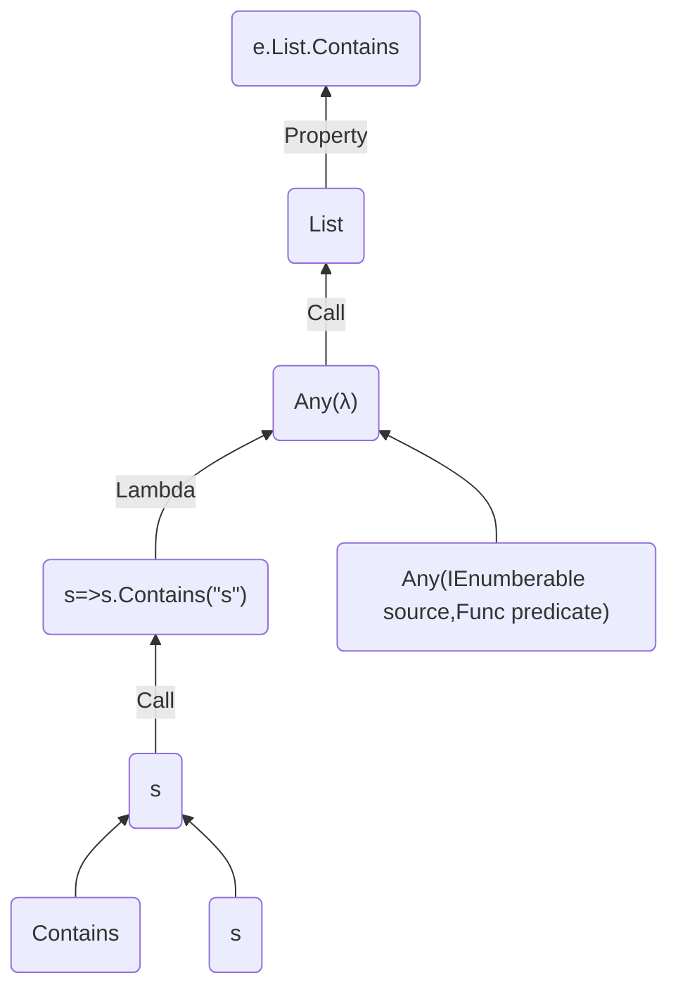
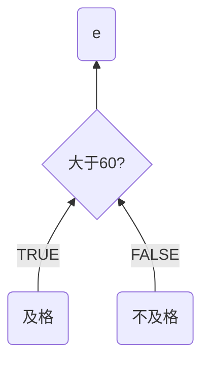
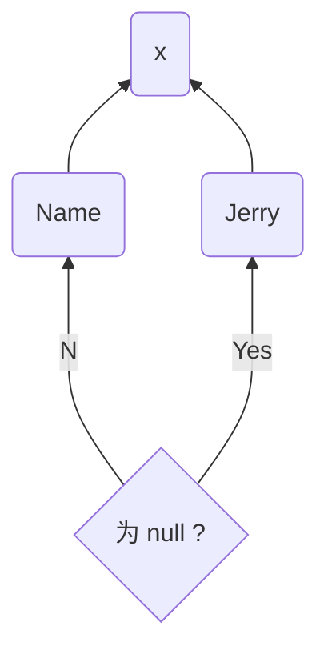
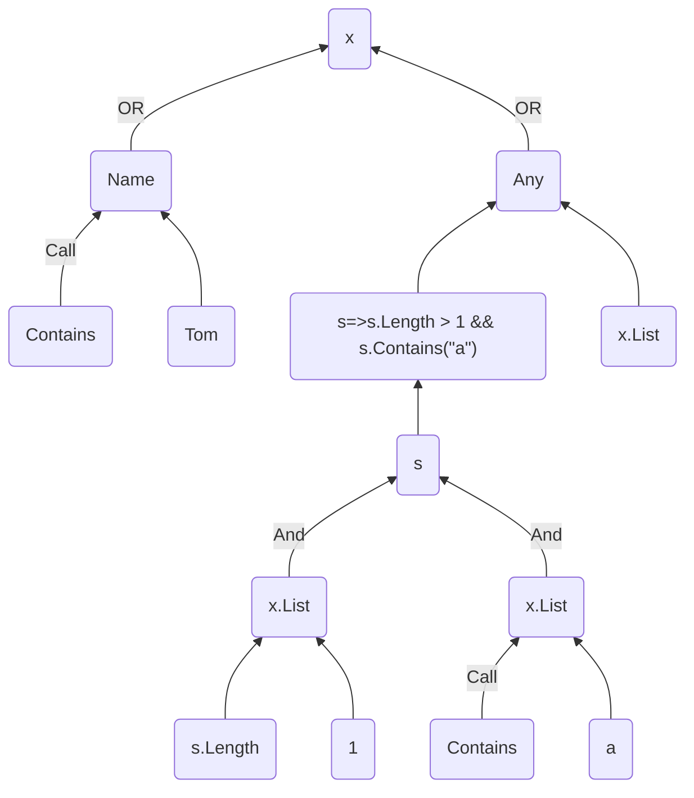
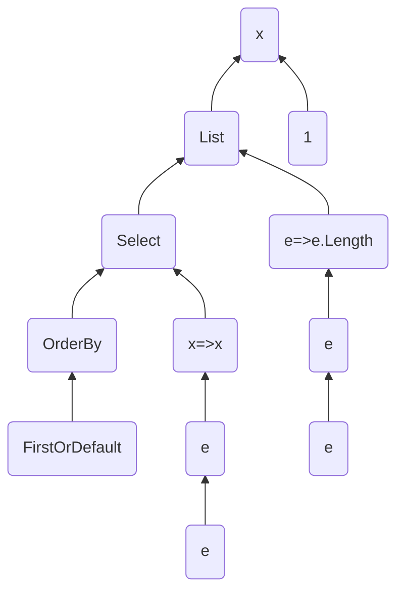

# λ表达树，Lambda，委托
1. 委托是一种类型，是方法的抽象，通过委托可以将方法以参数的形式传递给另一个方法，同时调用委托的时候，他所包含的方法都会被实现。使用关键字`Delegate`，可以自定义委托，也可以使用内置的委托，通过简化，可以将Lambda表达式或者Lambda语句赋值给委托，委托的调用包含了同步和异步。
2. Lambda式当委托只有一句话的时候的最简写形式。 x => x * 12;
3. 表达树(Expression)是一种数据结构，表达树也称为目录树，是将代码以一种抽象的方法表示成一个对象树。数中的每个节点本身是一个表达式。表达式树不是可执行代码，它是一种数据结构。可以利用Lambda表达式进行声明，Lambda表达式的规则要符合Expression中Func委托的参数规则，但Lambda语句是不能声明的。
4. Lamda表达式不仅可以用来创建委托，编译器也可以把他们转化为表达式树。

```C#
Func<int,int,int> func1 = new Func<int,int,int>((int m,int n)=>{
    return m*n+2;
});

// 对其进行最简化(Lambda 语句)
Func<int,int,int> fun2 = (m,n)=>{
    return m*n+2;
};

// 对其进行最简化(Lambda表达式)
Func<int,int,int> fun3 = (m,n)=> m*n + 2;
```
## λ表达式树
λ表达式树也是代码，可以把他当成另一种动态语言进行学习。它同样有常量，参数，运算，判断等操作，λ表达式树的本质就是一个方法的编译状态，如 `x=>x+1`这个最基本的表达式，他对应的等效方法就是：
```C#
int calc(int x){
    return x + 1;
}
```
可以简单分析 x => x + 1表达式的每个成分：

| 名称 | 解释 |
| ---- | ---- |
| x | 参数 x |
| => | {} 花括号 |
| + | add 操作 |
| 1 | 常量 |

为什么叫表达式树呢?
x => x + 1 他的每一个成分都是一个节点，每个节点之间进行关联，得到最终的表达式，故称之为表达式树。如图：


**(a,b)=> a * 3 + b * 4**

**通过Expression类构造一个最基本的λ表达式树**
```C#
// x => x+1
var x = Expression.Parameter(typeof(int),"x");
var one = Expression.Constant(1);
var addExp = Expression.Add(x,one);
var lambda = Expression.Lambda<Func<int,int>>(addExp,x);
var fun = lambda.Complie();
```
在处理一个稍稍复杂的式子 (x,y)=> x * 3+y * 4
```C#
// (x,y)=>x*3+y*4
var x = Expression.Parameter(typeof(int),"x");
var y = Expression.Parameter(typeof(int),"y");

var three = Expression.Constant(3);
var four = Expression.Constant(4);

var left = Expression.Multiply(x,three); // x * 3
var right = Expression.Multiply(y,four); // y * 4

var lambda = Expression.Lambda<Func<int,int,int>>(Expression.Add(left,right),x,y); // (x,y)=> x*3 + y*4;
var fun = lambda.Complie();
```

再处理一个更为复杂的式子
```C#
// (a,b,c,d,e)=>((a+b)*(c-d)) % e

var a = Expression.Parameter(typeof(double),"a");
var b = Expression.Parameter(typeof(double),"b");
var c = Expression.Parameter(typeof(double),"c");
var d = Expression.Parameter(typeof(double),"d");
var e = Expression.Parameter(typeof(double),"e");

var a_add_b = Expression.Add(a,b);
var c_sub_d = Expression.Subtract(c,d);
var multi = Expression.Multiply(a_add_b,c_sub_d);
var mod = Expression.Modulo(multi,e);
var lambda = Expression.Lambda<Func<double,double,double,double,double>>(mod,a,b,c,d,e);
var fun = lambda.Complie();

```

## 代替反射
```c#
public class Customer
{
    public Customer(int num)
    {
        Number = num;
    }

    public bool IsOK{get;set;}
    public int Number{get;set;}
    public string Name {get;set;}
    public List<string> List{get;set;}
    public string SayHello(string msg)
    {
        return msg + DateTime.Now.ToString("yyyy-MMM-dd");
    }
}
```

创建`new Customer(100)`，需要用到Expression.New创建对象实例。


```C#
var newObj = Expression.New(typeof(Customer).GetConstructor(new []{typeof(int)}),Expression.Constant(100));
// var newObj = Expression.New(typeof(Customer)); // 无参构造函数
var lambda = Expression.Lambda<Func<Customer>>(newObj);

var myCus = lambda.Complie();
```
**x => x.Name**
```c#
using static System.Linq.Expressions.Expression;

var x = Parameter(typeof(Customer),"x");
var nameProp = Property(x,nameof(Customer.Name));
var lambda = Lambda<Func<Customer,string>>(nameProp,x);

var fun = lambda.Complie();
```

**x=>x.List = new List<string>(){"abc"}**
```c#
using static System.Linq.Expressions.Expression;

var x = Parameter(typeof(Customer),"x");
var listProp = Property(x,nameof(Customer.List));

var assignExp = Assign(listProp, Constant(new List<string>(){"abc"}));
var lambda = Lambda<Action<Customer>>(assignExp,x);

```

调用 **x=>x.GetHashCode**
```c#
using static System.Linq.Expressions.Expression;

var x = Parameter(typeof(Customer),"x");
var callExp = Call(x,typeof(Customer).GetMethod(nameof(GetHashCode)));

var lambda = Lambda<Func<Customer,int>>(callExp,x);
```

调用 **x=>x.SayHello("Jerry")**

```c#
using static System.Linq.Expressions.Expression;

var x = Parameter(typeof(Customer),"x");
var method = typeof(Customer).GetMethod("SayHello",new []{ typeof(string)});
var callExp = Call(x,method,Constant("Jerry"));

var lambda = Lambda<Func<Customer,string>>(callExp, x);
```

调用**x=>x.List.Contains("s")**
```c#
using static System.Linq.Expressions.Expression;

var x = Parameter(typeof(Customer),"x");
var listProp = Property(x,nameof(Cusotmer.List));
// 获取扩展方法
var containsMethod = typeof(Enumberable).GetMethods().FirstOrDefault(p=>p.GetParameters().Length == 2 && p.Name == "Contains").MakeGenericMethod(typeof(string));
var callExp = Call(null,containsMethod, listProp, Constant("s"));

var lambda = Lambda<Func<Customer,bool>>(callExp, x);
```


调用**x=>x.List.Any(item=>item.Contains("s"))**
```c#
var item = Parameter(typeof(string),"item");
var containsMethod = Call(item,typeof(string).GetMethod("Contains",new []{typeof(string)}));
var containLambda = Lambda(containsMethod,item);

var x = Propery(typeof(Customer),"x");
var listProp = Property(x, nameof(Customer.List));
var anyMethod = typeof(Enumberable).GetMethods().FirstOrDefault(p=>p.GetParameters().Length == 2 && p.Name == "Any").MakeGenericMethod(typeof(string));

var callExp = Call(null,anyMethod,listProp,containLambda);

var lambda = Lambda<Func<Customer,bool>>(callExp, x);
```

结构图

## 三目表达式

代码实现如下
```c#
var x  = Parameter(typeof(int),"x");
var gt60 = GreaterThan(x, Constant(60));
var condition = Condition(gt60, Constant("及格"),Constant("不及格"));
var lambda = Lambda<Func<int,string>>(condition,x);
```
参数为对象的方式：
```c#
var x = Parameter(typeof(Customer),"x");
var isOKProp = Property(x,nameof(Customer.IsOK));
var condition = Condition(isOKProp, Constant("Real"),Constant("fake"));

var lambda = Lambda<Function<Customer,string>>(condition,x);

```
## NULL值表达式
> x=>x.Name??"Jerry";
Expression.Coalesce便是对标C# 6.0专属的null值表达式。
结构图

具体代码
```c#
var x = Parameter(typeof(Customer),"x");
var nameProp = Property(x, nameof(Customer.Name));

var coalesce= Coalesce(nameProp, Constant("Jerry"));

var lambda = Lambda<Func<Customer,string>>(coalesce,x);
```

## 类型转化
> Convert.ToInt32(10.23)
```c#
var convertExp = Convert(Constant(10.23),typeof(int));
var lambda = Lambda<Func<int>>(convertExp);
```

## 声明一个数组对象

> Expression.NewArryBounds 生成一个创建数组对象的表达式
> ()=> new System.String[](5);
```c#
var array = NewArrayBounds(typeof(string),Constant(5));
var lambda = Lambda<Func<string[]>>(array);
```

## 实现条件表达式
> x => x.Name.Contains("Tom") || x.List.Any(s=>s.Length > 1 && s.Contains("a"));

**流程图**


具体代码如下：
```c#
var s = Expression.Parameter(typeof(string),"s");

var length = Expression.Property(s,nameof(string.Length));
var gt1 = Expression.GreaterThan(length, Expression.Constant(1));
var s_contains = Expression.Call(s, typeof(string).GetMethod("Contains", new[] {typeof(string)}), Expression.Constant("a"));
var anyWhere = Expression.AndAlso(gt1,s_contains);
var anyLambda = Expression.Lambda(anyWhere, s);
// s=>s.Length > 1 && s.Contains("s")
var anyMethod = typeof(Enumerable).GetMethods().FirstOrDefault(x => x.GetParameters().Length == 2 && x.Name == "Any").MakeGenericMethod(typeof(string));
var x = Expression.Parameter(typeof(Customer),"x");
var listProp = Expression.Property(x,nameof(Customer.List));
var whereLambda = Expression.Call(null,anyMethod,listProp,anyLambda);
// x.List.Any(s=>s.Length > 1 && s.Contains("Tome"))
var nameProp = Expression.Property(x, nameof(Customer.Name));
var containsMethod = Expression.Call(nameProp, typeof(string).GetMethod("Contains", new[] {typeof(string)}), Expression.Constant("Tom"));
var orElse = Expression.OrElse(containsMethod,whereLambda);
var lamda = Expression.Lambda<Func<Customer,bool>>(orElse,x);
```

> x => (x.Name.Contains("Tom") OrElse x.List.Any(s => ((s.Length > 1) AndAlso s.Contains("a"))))

## 链式调用 x=>x.List.Select(e=>e.Length).OrderBy(x=>x).FirstOrDefault() > 1

**流程图**


具体代码如下：
```c#
var x = Expression.Parameter(typeof(Customer),"x");
var listProp = Expression.Property(x,nameof(Customer.List));
var selectMethod = typeof(Enumerable).GetMethods().FirstOrDefault(x => x.GetParameters().Length ==2 && x.Name == "Select").MakeGenericMethod(typeof(string),typeof(int));

var e = Expression.Parameter(typeof(string),"e");
var lengthProp = Expression.Property(e,nameof(string.Length));
var selectLambda = Expression.Lambda(lengthProp,e);

var orderByMethod = typeof(Enumerable).GetMethods().FirstOrDefault(x => x.GetParameters().Length == 2 && x.Name == "OrderBy").MakeGenericMethod(typeof(int),typeof(int));
var firstOrDefaultMethod = typeof(Enumerable).GetMethods().FirstOrDefault(x => x.GetParameters().Length == 1 && x.Name == "FirstOrDefault").MakeGenericMethod(typeof(int));
var selectResult = Expression.Call(null,selectMethod,listProp,selectLambda);

var s = Expression.Parameter(typeof(int),"s");
var orderByLambda = Expression.Lambda(s,s);
var orderByResult = Expression.Call(null,orderByMethod,selectResult,orderByLambda);
var firstOrDefaultResult = Expression.Call(null,firstOrDefaultMethod,orderByResult);

var gt1 = Expression.GreaterThan(firstOrDefaultResult,Expression.Constant(1));
var lambda = Expression.Lambda<Func<Customer,bool>>(gt1,x);
```