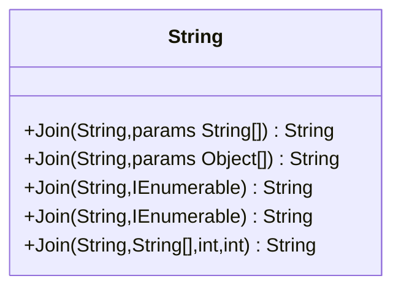
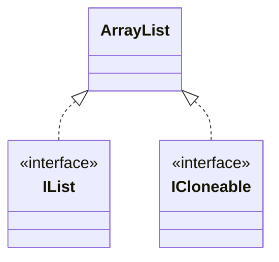

## String.Join("",ArrayList)为什么就不行

### 背景

> 昨日，在维护以前项目的时候，一个很旧的功能突然报错；查询提交日志，发现最近几年都没有人触碰过这文件中的代码。然后，进行跟踪调试，发现拼接字符串，调用`String.Join`没有得到预期的字符串，而是出现`System.Collections.ArrayList`这样的字符。

### String.Join有多少方法?

通过代码分析，得到如下：



&emsp;&emsp;从上图，我们可以清晰看到，`String.Join`就上述五种重载函数，支持可变字符串，支持可变对象，支持继承了`IEnumerable<T>`的对象，支持继承`IEnumerable<string>`的对象和一个传入字符串数组，从指定位置开始，截取count个字符的函数。

### ArrayList



&emsp;&emsp;从上图可以清晰看出，`ArrayList`实现了`IList`和`ICloneable`接口，虽说`IList`继承了`IEnumerable`接口。但是，此`IEnumerable`非彼`IEnumerable<T>`。两者一个普通接口，一个是泛型接口。

### 为何会出现`System.Collections.ArrayList`

&emsp;&emsp;根据`String.Join`函数，我们大胆推测一下，它使用的是一个`String.Join(String,params Object[])`这样的函数。那么这个函数里面是如何实现呢？

```c#
public static String Join(String separator, params Object[] values) 
{
    if (values==null)
        throw new ArgumentNullException("values");
    Contract.EndContractBlock();
 
    if (values.Length == 0 || values[0] == null)
        return String.Empty;

    if (separator == null)
        separator = String.Empty;

    StringBuilder result = StringBuilderCache.Acquire();

    String value = values[0].ToString();           
    if (value != null)
        result.Append(value);

    for (int i = 1; i < values.Length; i++) {
        result.Append(separator);
        if (values[i] != null) {
            // handle the case where their ToString() override is broken
            value = values[i].ToString();
            if (value != null)
                result.Append(value);
        }
    }
    return StringBuilderCache.GetStringAndRelease(result);
}
```

我们可以很清晰看到`String value = values[0].ToString()`这个不正是把一个对象变成字符串么。`ArrayList.ToString`不正是把这个对象的全名称显示出来吗。

### 结论

&emsp;&emsp;平时在使用`String.Join`拼接字符串的时候，一定需要注意，传入的对象，是否和Join中的参数匹配，能否达到预期。多尝试，多测试。